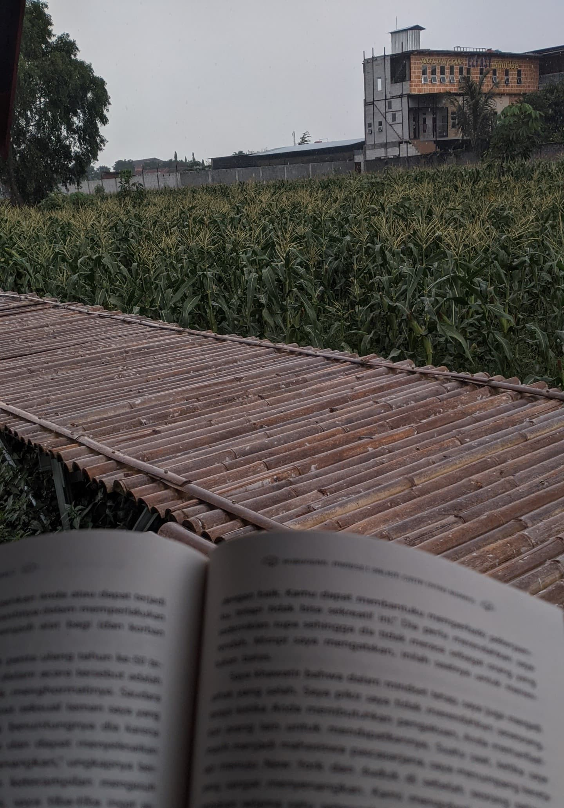

{: width="250" .w-20 .left }
<!-- File from cloudinary -->

Jika ada yang bilang buku bisa mengubah hidup, dulu aku akan menertawakannya. Sampai akhirnya, aku merantau. Ketika itu aku masih beranggapan bahwa pendidikan tidak terlalu penting. Setelah lulus sekolah, aku berencana langsung bekerja di bidang IT, yang sudah lama menarik perhatianku. Berhubung di dunia IT harus bisa bahasa Inggris dan merasa kemampuan bahasa Inggris masih terbatas, dengan terpaksa aku harus mengambil kursus di Kampung Inggris, Pare.

Untuk pertama kalinya dalam hidup, aku merantau. Di sana, bertemu teman-teman dari berbagai daerah, suku, dan budaya. Aku dikenal sebagai pribadi pendiam dan dingin, karena itu, teman-teman menjuluki ‘robot’, orang yang tidak pernah tersenyum. Mungkin karena saat mereka bersenda gurau, aku hanya duduk di pojok, tak tersenyum, dan acuh.

Tapi di balik sikap itu, aku lebih suka mengamati sebelum bertindak. Aku belajar membaca situasi dan membiasakan diri dengan berbagai karakter di sekitar. Setelah cukup memahami dinamika sosial yang ada, aku mulai membuka diri. Tak butuh waktu lama hingga aku memiliki banyak teman, termasuk Mr. Jo.

Ketertarikan pada buku bermula dari seorang tutor, seseorang yang eksentrik, dengan gaya pakaian dan bicara yang khas, dia suka bercerita. Kemanapun dia pergi, ia selalu membawa buku, dia hobi membaca, terkadang terlihat tenggelam dalam bacaannya. Aku suka menemaninya membaca ketika sore hari, dia sibuk dengan bukunya, aku sibuk dengan hafalanku. Kami memanggilnya Mr. Jo.

Sikapnya yang santai dan kecintaannya pada buku justru mengingatkanku pada tumpukan buku milik kakak di rumah. Aku sering membantu mencarikan buku ketika ada teman kakak yang ingin meminjam. Namun, tak satu pun buku pernah kubaca. Ibu kerap menyuruhku membaca agar pintar seperti kakak, yang berhasil mendapat beasiswa S2 dengan biaya penuh di luar negeri. Karena ego yang tinggi, aku justru melakukan sebaliknya, menolak membaca sebagai bentuk perlawanan diam-diam karena terus dibandingkan. Pengetahuanku tentang judul-judul buku inilah yang menjadi jembatan perbincangan kami.

Rasa penasaran perlahan tumbuh menjadi minat. Aku mulai bertanya tentang buku-buku yang dia baca dan mencoba membaca bukunya. Aku buka secara acak buku *Mendaki Tangga yang Salah* karya *Eric Barker*, dan sejak kalimat pertama, aku langsung terpikat. Penulis menyodorkan sudut pandang baru tentang kesuksesan, pemikiran-pemikiran yang bertentangan dengan logika umum. Aku menemukan gagasan-gagasan yang berani, seperti bagaimana kelemahan bisa menjadi kekuatan atau mengapa pelajaran kerja sama justru didapat dari kelompok yang tidak biasa. Dari prajurit Navy SEAL aku belajar, kesuksesan ditentukan oleh mental dan ketangguhan mental bukanlah bawaan lahir, melainkan hasil tempaan yang panjang. Selesai kubaca, aku merasa seperti baru saja membuka pintu ke sebuah dunia yang selama ini kuabaikan.

{: width="472" height="189" } 
<!-- File from cloudinary -->
_Setiap sore membaca dengan Mr. Jo_

*Mendaki Tangga yang Salah* menjadi buku pertama yang aku lahap sampai tuntas, dan membuatku ketagihan untuk membaca buku yang lain. Setiap sore aku habiskan untuk membaca dengan Mr. Jo. Malamnya aku lanjutkan sebelum tidur, tak jarang aku harus begadang karena ingin menyelesaikan bab yang terasa menggantung.

{: width="472" height="189" }
<!-- File from cloudinary -->
_Diskusi malam minggu dengan teman-teman_

Kebiasaan itu menular, teman-teman yang semula asing dengan buku, mulai tertarik membaca. Setiap malam minggu, kami mengadakan diskusi terbuka, berbagi cerita dari buku yang sedang dibaca, saling bertanya dan menjawab. Ada yang berbagi tentang filsafat, sastra, agama, dan ada pula yang membahas konspirasi. Siapapun boleh ikut dan bertanya, tak harus suka buku untuk bergabung. Di sinilah aku benar-benar jatuh cinta dengan buku.

Di sana, tidak hanya belajar bahasa Inggris, aku juga belajar tentang perbedaan, tentang budaya, dan yang terpenting, belajar mencintai sesuatu yang aku benci, buku. Dulu aku menganggap pendidikan tidak penting, kini membawa pulang oleh-oleh paling berharga, satu kotak penuh buku yang menjadi gerbang untuk mengarungi lautan ilmu pengetahuan. Sebuah perjalanan yang dimulai dari ketidaksukaan, menuju kecintaan yang dalam. Robot yang dingin itu telah meninggalkan jejak, memiliki banyak teman, dan menjadi pribadi yang menyenangkan di Pare.

<!-- {: width="200" .w-20 .left} -->
